<p align="center">
  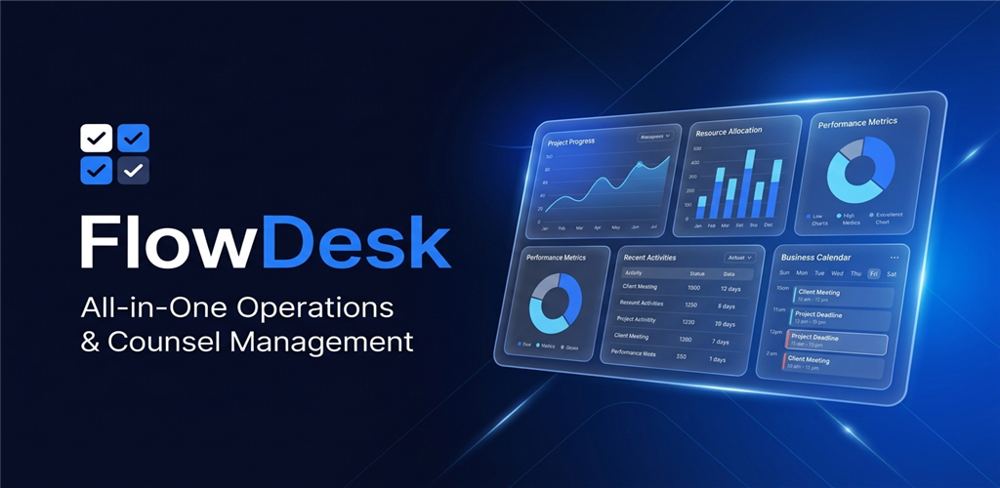
</p>

<h1 align="center">
  <b>Flowdesk Android</b>
</h1>

<p align="center">
  <strong>B2B SaaS형 엔터프라이즈 CRM & 맞춤형 업무 공간(Custom Workspace) 구축 플랫폼</strong>
  <br>
  <em>Clean Architecture • MVVM • Jetpack Components • Kotlin Coroutines & Flow</em>
</p>

<p align="center">
  <a href="https://kotlinlang.org/"></a>
  <a href="https://developer.android.com/"></a>
  <a href="https://developer.android.com/jetpack"></a>
  <a href="https://github.com/square/retrofit"></a>
  <a href="https://dagger.dev/hilt/"></a>
  <a href="LICENSE"></a>
</p>

---

## 📌 목차 (Table of Contents)
- [✨ 프로젝트 소개 (Overview)](#-프로젝트-소개-overview)
- [📱 주요 기능 및 화면 스크린샷 (Features & Screenshots)](#-주요-기능-및-화면-스크린샷-features--screenshots)
  - [📊 1. 상담 분석 대시보드 & 상담 일정 관리](#-1-상담-분석-대시보드--상담-일정-관리)
  - [👥 2. 사용자 및 세분화된 역할 권한 관리 (RBAC)](#-2-사용자-및-세분화된-역할-권한-관리-rbac)
  - [⚙️ 3. 테넌트 및 시스템 차단 설정 관리](#️-3-테넌트-및-시스템-차단-설정-관리)
  - [📝 4. 컨텐츠 게시판 및 계정 설정](#-4-컨텐츠-게시판-및-계정-설정)
- [🛠️ 기술 스택 (Tech Stack)](#️-기술-스택-tech-stack)
- [🏛️ 아키텍처 구조 (Architecture)](#️-아키텍처-구조-architecture)
- [🎨 UI/UX 디자인 시스템 수칙](#-uiux-디자인-시스템-수칙)
- [🚀 시작하기 (Quick Start)](#-시작하기-quick-start)
- [📖 문서 및 온보딩 (Documentation)](#-문서-및-온보딩-documentation)

---

## ✨ 프로젝트 소개 (Overview)

**Flowdesk Android**는 기업 맞춤형 B2B SaaS CRM 모바일 플랫폼입니다.  
멀티 테넌트 환경에서의 효율적인 고객 상담 분석, 캘린더 기반 일정 추적, 팀원별 세부 역할(Role) 및 권한(Permission) 제어, 시스템 보안 정책을 모바일 환경에서 완벽하게 제어할 수 있도록 설계되었습니다.

### 🌟 핵심 가치
* **실시간 CRM 분석 & 모바일 일정 동기화**: 상담 현황 실시간 차트 통계 및 월간/일간 캘린더 연동
* **세분화된 엔터프라이즈 RBAC**: 팀원별 맞춤형 접근 제어 및 권한 복사/위임 시스템
* **안전한 인증 & 세션**: `AuthInterceptor` 및 `TokenAuthenticator`를 통한 401 자동 토큰 갱신 파이프라인
* **정돈된 모던 디자인 시스템**: WindowInsets 기반 노치 침범 방지, 아코디언 드로어 네비게이션, 언더라인 입력 폼

---

## 📱 주요 기능 및 화면 스크린샷 (Features & Screenshots)

### 📊 1. 상담 분석 대시보드 & 상담 일정 관리

고객 인입 통계, 접수 현황, 처리율을 한눈에 파악하는 직관적인 대시보드와 월간/일간 상담 일정 캘린더를 제공합니다.

#### 📈 실시간 상담 분석 대시보드

| 📊 상담 인입 통계 | 📈 처리율 & 성과 분석 | ⏱️ 접수 현황 모니터링 |
| :---: | :---: | :---: |
| 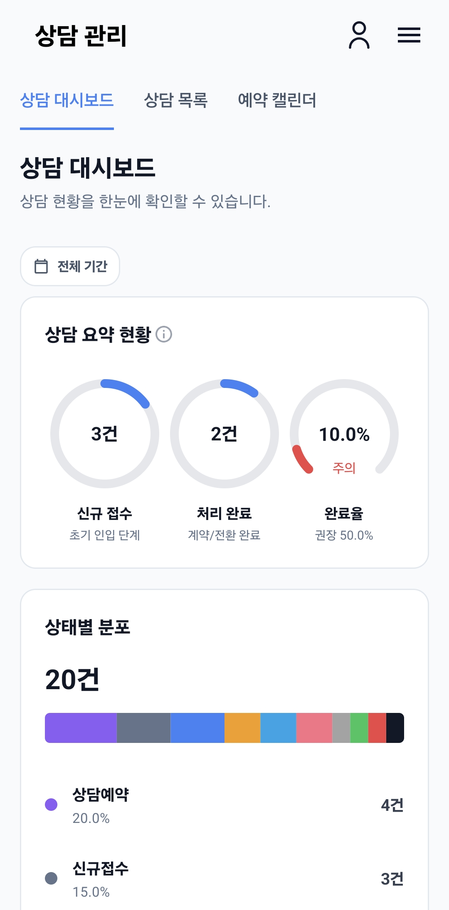 | 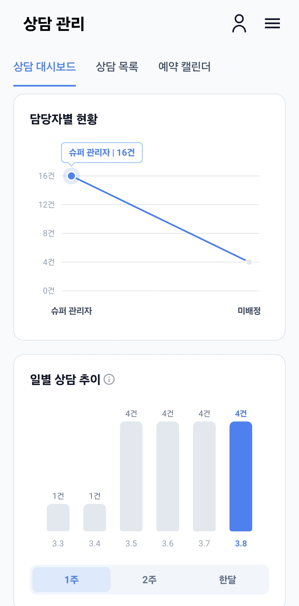 | 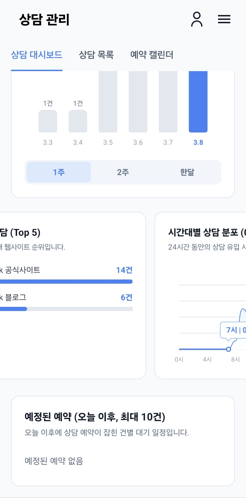 |
| • 유형별·시간대별 인입 분포 시각화<br>• MPAndroidChart 기반 동적 차트 | • 실시간 상담 처리율 및 만족도 지표<br>• 담당자별 성과 비교 통계 | • 상태별 실시간 접수 카운팅<br>• 대기/진행중 현황 실시간 트래킹 |

#### 📅 상담 목록 검색 & 캘린더 스케줄러

| 📋 다중 필터 상담 목록 | 📅 월간/일간 상담 캘린더 |
| :---: | :---: |
| 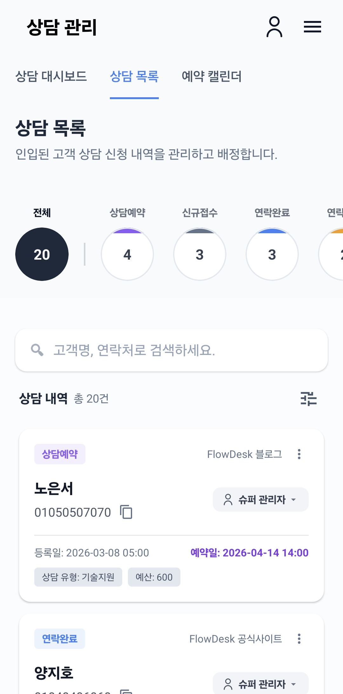 | 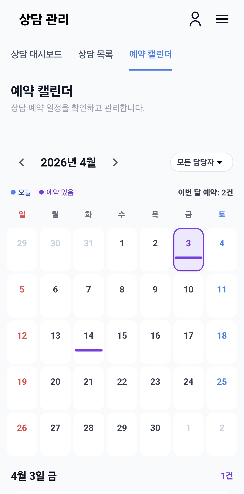 |
| • 상담 상태(접수/진행/완료), 기간, 담당자별 맞춤 검색<br>• 플랫 카드 & 아코디언 세부 메뉴 연동 | • 날짜별 예약된 상담 일정을 타임라인으로 조회<br>• 터치 인터랙션을 통한 상세 상담 카드 직관 확인 |

---

### 👥 2. 사용자 및 세분화된 역할 권한 관리 (RBAC)

조직의 구성원을 안전하게 초대하고, 각 메뉴 및 기능별 세부 권한을 매트릭스 형태로 부여합니다.

| 👤 팀원 및 계정 관리 | 🛡️ 역할 & 세부 권한 매트릭스 (RBAC) |
| :---: | :---: |
| 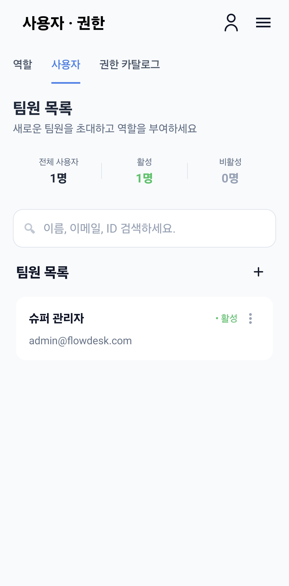 | 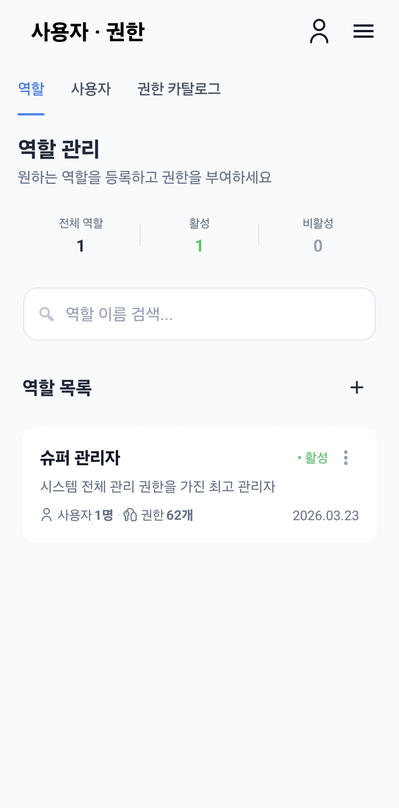 |
| • 팀원 목록 조회, 초대 및 상태(활성/비활성) 제어<br>• 역할 배정 및 프로필 상태 실시간 동기화 | • 권한 카탈로그 기반 메뉴별 읽기/쓰기 권한 부여<br>• 기존 역할 권한 원클릭 복사 및 위임 기능 |

---

### ⚙️ 3. 테넌트 및 시스템 차단 설정 관리

시스템 관리자 전용 테넌트 상태 모니터링 및 악성 접근 방지를 위한 보안 차단 정책을 관리합니다.

| 🏢 테넌트 상태 & 테마 관리 | 🚫 비정상 접근 & 키워드 차단 |
| :---: | :---: |
| 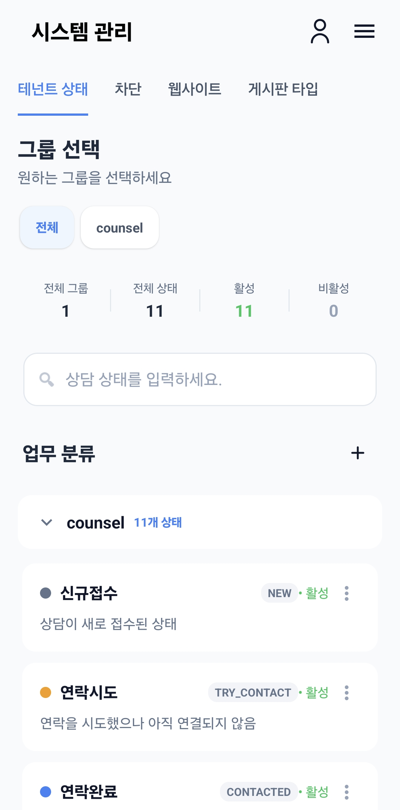 | 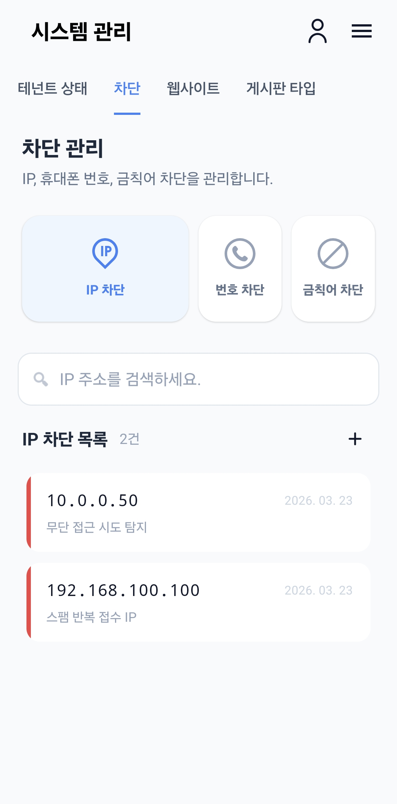 |
| • 테넌트별 운영 상태 및 웹사이트 설정 제어<br>• 커스텀 상태 컬러 피커 연동으로 시각적 브랜딩 | • 악성 접근 IP 실시간 차단 및 해제 다이얼로그<br>• 부적절 키워드 필터링 정책 모바일 즉시 반영 |

---

### 📝 4. 컨텐츠 게시판 및 계정 설정

사내 공지 및 게시판 운영과 개인 계정 알림/보안 옵션을 손쉽게 관리할 수 있습니다.

| 📢 사내 공지 및 게시판 운영 | ⚙️ 마이페이지 및 보안 설정 |
| :---: | :---: |
| 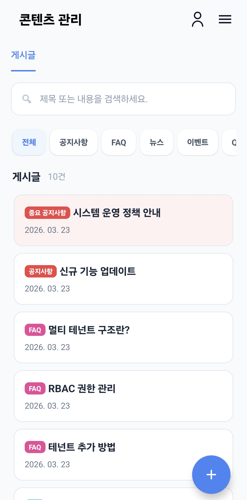 | 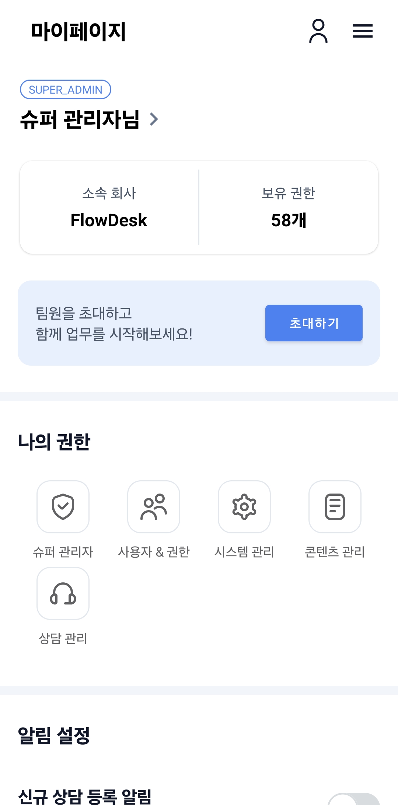 |
| • 게시판 카테고리별 공지/게시글 작성·수정·삭제<br>• 언더라인 폼 기반 깔끔한 입력 경험 | • 프로필 수정, 비밀번호 변경, 다크모드 대응<br>• 서비스 알림 수신 설정 및 세션 관리 |

---

## 🛠️ 기술 스택 (Tech Stack)

| 영역 | 사용 기술 / 라이브러리 |
|---|---|
| **Language** | Kotlin 2.0+ |
| **Target SDK** | minSdk 30 (Android 11) / targetSdk 36 |
| **Architecture** | Clean Architecture + MVVM (Model-View-ViewModel) |
| **UI Components** | Android Jetpack (Fragment, ViewBinding, Navigation Component) |
| **Asynchronous & State** | Kotlin Coroutines, StateFlow, LiveData |
| **Dependency Injection** | Hilt (Dagger-Hilt) |
| **Network & Serialization** | Retrofit2, OkHttp3 (HttpLoggingInterceptor), Gson |
| **Custom UI & Charts** | MPAndroidChart, ColorPickerView, Lottie Animation, Flexbox |
| **Build & Tooling** | Gradle 9.3.1, ProGuard / R8 Obfuscation & Resource Shrinking |

---

## 🏛️ 아키텍처 구조 (Architecture)

관심사의 명확한 분리(Separation of Concerns)와 유지보수성을 위해 **3계층 Clean Architecture** 레이어로 구성되어 있습니다.

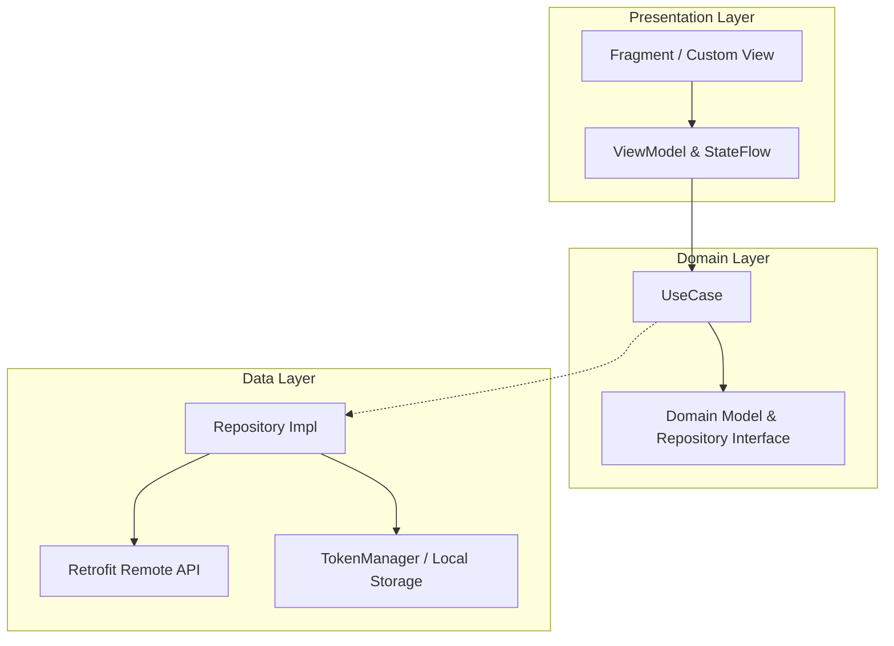

### 계층별 역할
1. **`Presentation Layer`**: 화면 UI, ViewBinding, 네비게이션 액션, ViewModel 상태 관리
2. **`Domain Layer`**: 순수 비즈니스 로직 유스케이스 (`UpdateRolePermissionsUseCase` 등), 도메인 엔티티
3. **`Data Layer`**: `UserRepositoryImpl`, API 데이터 전송 객체(DTO), `TokenManager` 및 세션 토큰 관리

---

## 🎨 UI/UX 디자인 시스템 수칙

본 프로젝트는 [`AGENTS.md`](.agents/AGENTS.md) 표준 가이드라인에 맞춰 제작되었습니다.

1. 📱 **WindowInsets 카메라 노치 영역 보호**
   * 상단 시스템 바 패딩을 동적으로 확보하여 서브 화면의 레이아웃 가림 방지
2. 🚫 **서브 화면 하단 네비게이션 바 자동 숨김**
   * 상세/수정/초대 서브 페이지 진입 시 하단 바 비노출 처리로 화면 몰입감 향상
3. 📝 **깔끔한 밑줄 스타일(Underline Input Form)**
   * 투명 배경(`@null`)과 1dp 하단 구분선, 필수 입력 항목 우측 빨간 별표(`*`) 표기
4. ⏳ **로딩 가시성 보장 (Loading State)**
   * API 호출 중 뼈대 깜빡임을 방지하기 위해 `View.INVISIBLE` 상태에서 ProgressBar만 표출

---

## 🚀 시작하기 (Quick Start)

### 사전 요구 사항
* Android Studio (2024.x 이상)
* JDK 17 이상
* Android SDK 30 (Android 11) 이상

### 빌드 및 실행 방법
```bash
# 레포지토리 클론
git clone https://github.com/pasic/flowdeskandroid.git
cd flowdeskandroid

# 디버그 APK 빌드
./gradlew assembleDebug

# 릴리즈 번들(AAB) 빌드
./gradlew bundleRelease
```

---

## 📖 문서 및 온보딩 (Documentation)

* 📖 **[신규 개발자 온보딩 가이드](docs/ONBOARDING.md)**: 전체 아키텍처 및 추천 학습 경로
* 🎨 **[프로젝트 개발 규칙 (AGENTS.md)](.agents/AGENTS.md)**: UI/UX 디자인 규격 및 상태 관리 표준
* 🔒 **[개인정보처리방침 (Privacy Policy)](https://cdiff.github.io/flowdeskandroid/privacy-policy/)**: 구글 플레이스토어 정책 웹페이지

---

<p align="center">
  <sub>Built with ❤️ for Flowdesk Android Team</sub>
</p>
