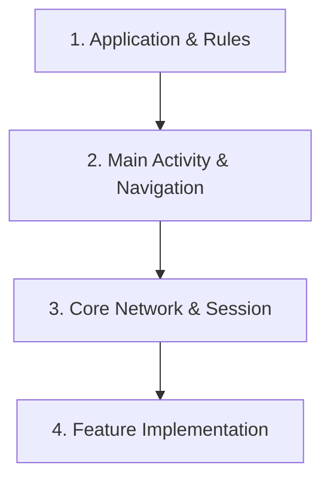

# 🚀 Flowdesk Android — 신규 개발자 온보딩 가이드 (Onboarding Guide)

Flowdesk Android 프로젝트에 오신 것을 환영합니다!  
본 가이드는 프로젝트의 전체 아키텍처, 핵심 레이어, 디자인 시스템 가이드라인, 추천 학습 경로를 한눈에 파악할 수 있도록 구성되어 있습니다.

---

## 📋 1. 프로젝트 개요 (Project Overview)

* **프로젝트명**: `flowdeskandroid`
* **주요 언어**: Kotlin (100%), XML, Gradle KTS
* **핵심 기술 스택 & 프레임워크**:
  * **Architecture**: MVVM (Model-View-ViewModel) + Clean Architecture (Presentation, Domain, Data)
  * **UI Component**: Android Jetpack (Fragment, ViewBinding, Navigation Component)
  * **Asynchronous / State**: Kotlin Coroutines & Flow, StateFlow / LiveData
  * **Network & Storage**: Retrofit2, OkHttp3, EncryptedSharedPreferences (`SessionManager`)
  * **DI & Utility**: Hilt / Network Modules

---

## 🏛️ 2. 아키텍처 레이어 (Architecture Layers)

프로젝트는 관심사 분리(Separation of Concerns) 원칙에 따라 6개 레이어로 명확히 구분되어 있습니다.

```
┌──────────────────────────────────────────────────────────┐
│              1. Presentation & UI Layer                  │
│       (Fragments, ViewModels, Custom Widgets)            │
└──────────────────────────┬───────────────────────────────┘
                           ▼
┌──────────────────────────────────────────────────────────┐
│                  2. Domain Layer                         │
│           (UseCases, Models, Repositories)               │
└──────────────────────────┬───────────────────────────────┘
                           ▼
┌──────────────────────────────────────────────────────────┐
│                  3. Data Layer                           │
│        (RepositoryImpls, Retrofit APIs, Managers)        │
└──────────────────────────────────────────────────────────┘
```

| 레이어 | 설명 | 대표 클래스 / 경로 |
|---|---|---|
| 🎨 **Presentation** | UI 레이아웃 표현 및 사용자 이벤트 수신, 상태 관리 | `feature/*/presentation/` (`LoginFragment`, `InviteRoleFragment`, `MainViewModel`) |
| 💼 **Domain** | 순수 비즈니스 로직 및 UseCase, 엔티티 정의 | `feature/*/domain/` (`UpdateRolePermissionsUseCase`, `UserRepository`) |
| 💾 **Data** | API 통신, 로컬 데이터 저장소 및 Repository 구현체 | `feature/*/data/` (`UserRepositoryImpl`, `SessionManager`, `TokenManager`) |
| 🛠️ **Core** | 앱 공통 모듈, 베이스 클래스 및 확장 함수 | `core/base/` (`BaseFragment`, `BaseViewModel`), `core/network/` (`AuthInterceptor`, `TokenAuthenticator`) |
| 💉 **DI** | 의존성 주입 객체 그래프 생성 | `di/` (`NetworkModule`) |
| 🖼️ **Resources** | 레이아웃, 탐색 그래프, 스타일 및 테마 정의 | `res/layout/`, `res/navigation/` (`nav_graph_main.xml`), `res/values/` |

---

## 🎨 3. UI/UX 디자인 시스템 표준 규칙 (`AGENTS.md`)

모든 화면 개발 시 반드시 준수해야 하는 프로젝트 고유 규칙입니다.

1. **카메라 노치 침범 방지 (`WindowInsets`)**
   * 상세/수정 서브 화면은 `ViewCompat.setOnApplyWindowInsetsListener`를 사용하여 카메라 홀에 가려지지 않도록 상단 패딩을 동적으로 확보합니다.
2. **서브 화면 하단 네비게이션 숨김**
   * 메인 탭이 아닌 상세/수정/초기화 페이지에서는 `BottomNavigationView`를 보이지 않도록 제어합니다.
3. **입력 폼 하단 밑줄 스타일 (Underline Style)**
   * 사각형 박스를 지양하고 `android:background="@null"` 투명 배경과 1dp 하단 구분선(`View`)을 배치합니다. 필수 입력값 항목은 우측에 빨간색 별표(`*`) 표시를 둡니다.
4. **로딩 가시성 제어 (Loading State)**
   * 데이터 조회 전에는 입력 폼(`ScrollView`)을 `View.INVISIBLE`로 숨기고ProgressBar만 노출하여 깜빡임을 방지합니다.

---

## 🧭 4. 추천 온보딩 학습 경로 (Guided Tour)

신규 개발자가 코드베이스를 파악할 때 아래 순서대로 확인하는 것을 권장합니다.



### 1단계: 프로젝트 엔트리 & 규칙 숙지
* 📄 [`FlowDeskApplication.kt`](file:///c:/Users/pasic/flowdeskandroid/app/src/main/java/com/example/flowdesk_android/FlowDeskApplication.kt) — 앱 초기화 시작점
* 📄 [`AGENTS.md`](file:///c:/Users/pasic/flowdeskandroid/.agents/AGENTS.md) — 프로젝트 UI/UX 및 상태 관리 가이드라인

### 2단계: 메인 네비게이션 흐름 파악
* 📄 [`MainActivity.kt`](file:///c:/Users/pasic/flowdeskandroid/app/src/main/java/com/example/flowdesk_android/feature/main/MainActivity.kt) — 탭 화면 전환 및 서브 화면 바텀바 숨김 제어
* 📄 [`nav_graph_main.xml`](file:///c:/Users/pasic/flowdeskandroid/app/src/main/res/navigation/nav_graph_main.xml) — 화면 간 이동 라우팅 및 딥링크 정의

### 3단계: 네트워크 통신 & 보안 모듈
* 📄 [`AuthInterceptor.kt`](file:///c:/Users/pasic/flowdeskandroid/app/src/main/java/com/example/flowdesk_android/core/network/AuthInterceptor.kt) — API 요청 시 AccessToken 자동 주입
* 📄 [`TokenAuthenticator.kt`](file:///c:/Users/pasic/flowdeskandroid/app/src/main/java/com/example/flowdesk_android/core/network/TokenAuthenticator.kt) — HTTP 401 발생 시 RefreshToken 재발급 로직
* 📄 [`SessionManager.kt`](file:///c:/Users/pasic/flowdeskandroid/app/src/main/java/com/example/flowdesk_android/data/local/SessionManager.kt) — 세션 상태 관리

### 4단계: 비즈니스 기능 구현 참고
* 📄 [`UserRepositoryImpl.kt`](file:///c:/Users/pasic/flowdeskandroid/app/src/main/java/com/example/flowdesk_android/feature/user_management/data/repository/UserRepositoryImpl.kt) — 회원 관리 Data Layer 패턴
* 📄 [`InviteRoleFragment.kt`](file:///c:/Users/pasic/flowdeskandroid/app/src/main/java/com/example/flowdesk_android/feature/user_management/presentation/users/invite/InviteRoleFragment.kt) — 역할 부여 및 초청 UI 패턴

---

## ⚠️ 5. 주요복잡도 집중 영역 (Complexity Hotspots)

새로운 기능을 추가하거나 수정할 때 주의 깊게 접근해야 하는 모듈입니다.

1. **`TokenAuthenticator.kt` (네트워크 인증 갱신)**
   * 동시 다발적 401 오류 발생 시 락(Lock) 및 동기화 처리 구획이므로 수정 시 스레드 안정성을 검증해야 합니다.
2. **`UserRepositoryImpl.kt` (사용자 관리 및 권한)**
   * 역할(Role), 팀(Team), 사용자 초대(Invite) 및 권한 동기화가 복합적으로 연계된 데이터 레이어입니다.
3. **Multi-step Invite Flow (`InviteRoleFragment` 등)**
   * 단계별 ViewModel 데이터 유지 및 화면 백스택(`popBackStack()`) 상태 동기화 처리를 확인해야 합니다.

---

*본 가이드는 `/understand-onboard` 스킬을 통해 자동으로 추출되어 생성되었습니다.*
